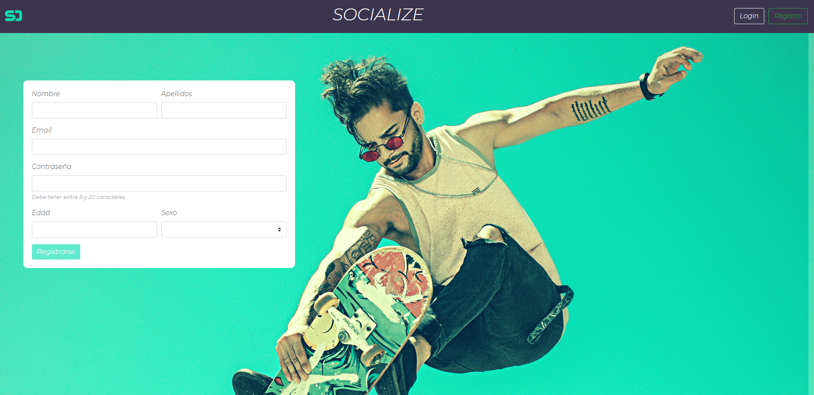
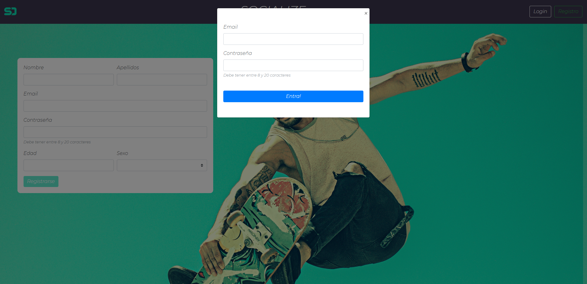
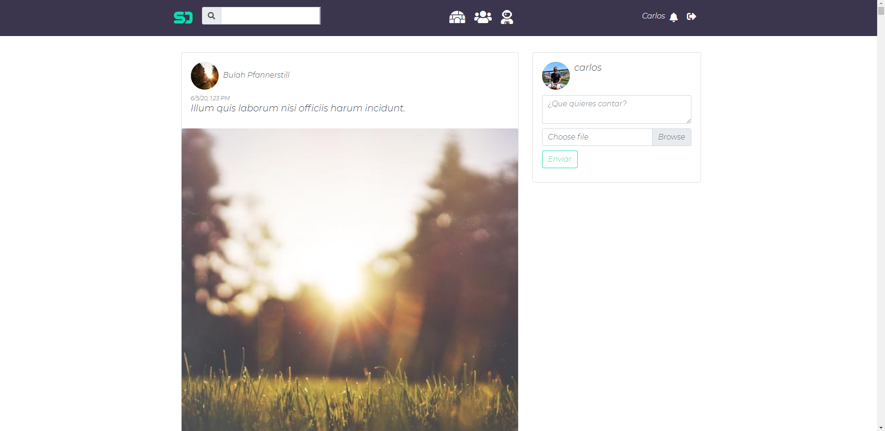
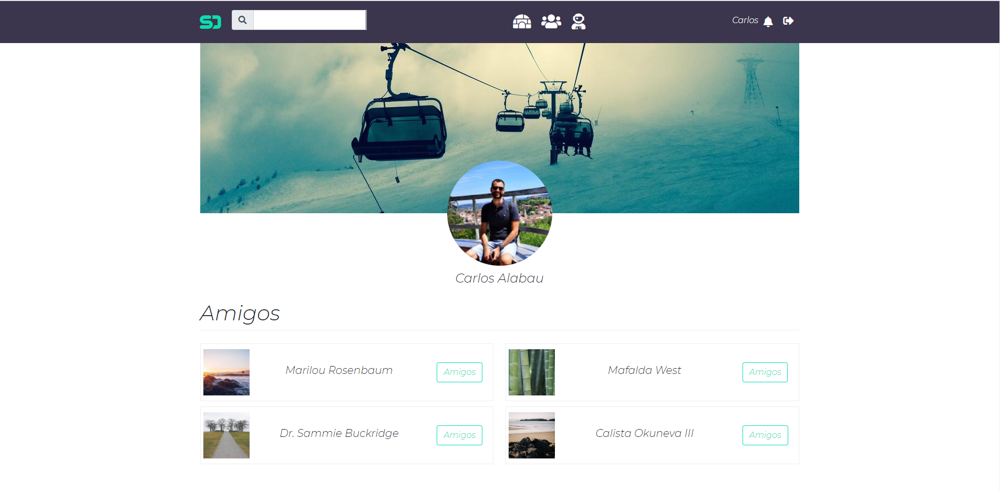
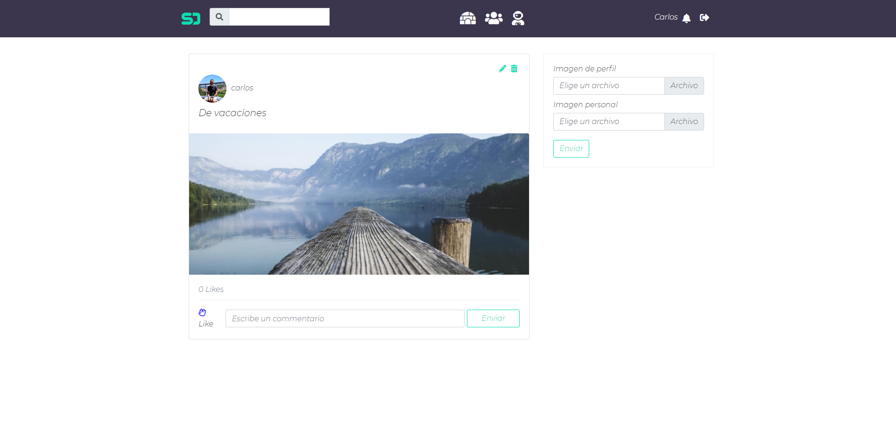
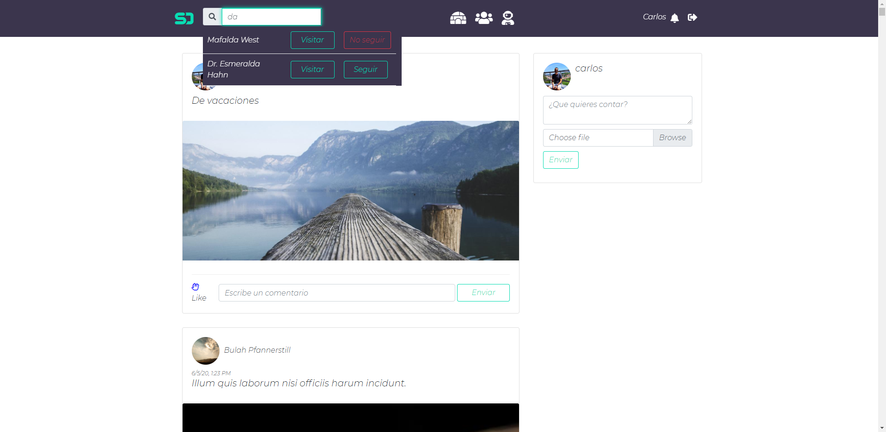

# ProyectoFinalAngular

Este proyecto ha sido desarrollado con [Angular CLI](https://github.com/angular/angular-cli) version 9.1.7.
Consiste en una red social donde cualquier usuario se puede registrar y realizar publicaciones, asi como tener amistades. 
Para una mejor funcionalidad recomiendo vincularlo con el backend de mi repositorio https://github.com/carlosalabau/red_social_backend

## Comenzando

### Pre-Requisitos

Vas a necesitar un IDE como por ejemplo Visual Code Studio.
Necesitas tener instalado en tu PC NodeJS.

### Instalacion

Para poder tener el proyecto funcionando en tu PC necesitas realizar lo siguiente:
  1. Instalar Angular en la carpeta del proyecto, para ello ejecuta el comando npm install -g @angular/cli en la carpeta correspondiente.
  2. Instalar todas las dependencias del proyecto con el comando "npm install". 
  3. Para inciar ejecuta el comando "ng serve -o". Se abrira una ventana en tu navegador con la web.

### Vista previa

Si has seguido todos los pasos y has vinculado el backend con este proyecto veras algo parecido a esto:

Pagina inicial y de registro.

Login

Pagina principal una vez te logueas

Pagina del usuario donde puedes ver tus amistades y fotos de perfil.

Pagina de perfil del usuario o usuarios donde editas las imagenes de perfil y la publicacion.

Esta es la funcionalidad para buscar usuarios en la web.

## Autor

Carlos Alabau - Full Stack Developer
